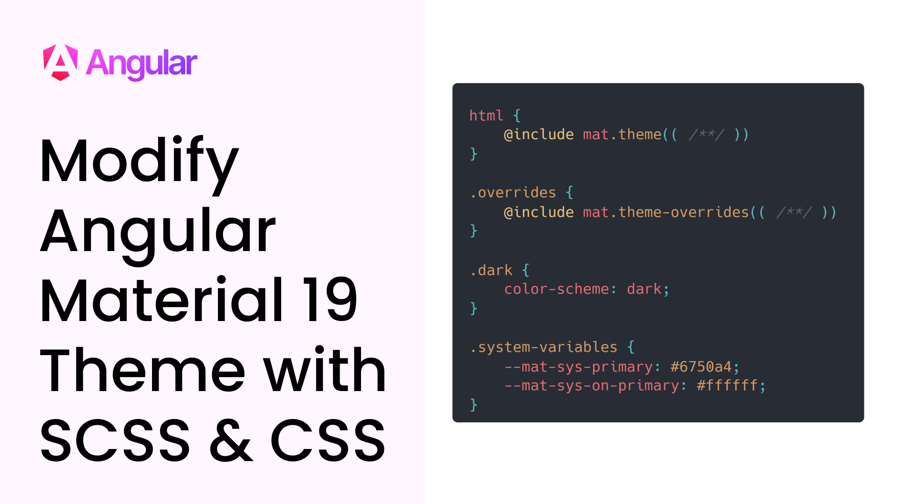

# Modify Angular Material 19 Theme with SCSS & CSS

[](#)

Watch video on [youtube](#). Or [read article online](https://angular-material.dev/articles/modify-angular-material-19-theme-with-scss-css).

## Getting Started

Starting of the code is present in [📁 start](./start/) and final code is present in [📁 end](./end/).

Go to any folder, and to run the project, do following...

```bash
npm i
npm start
```